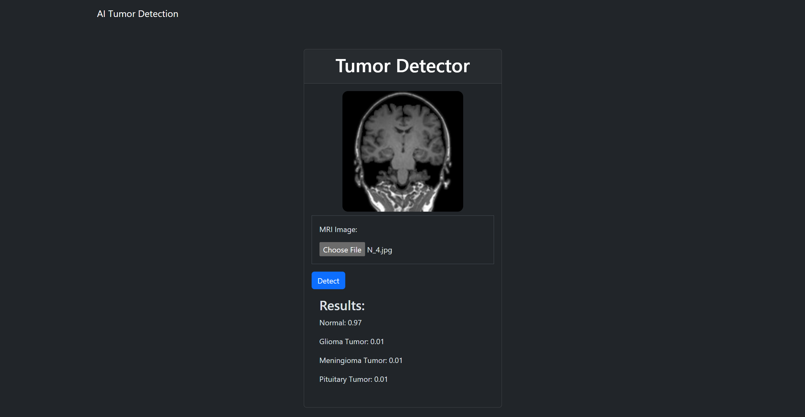
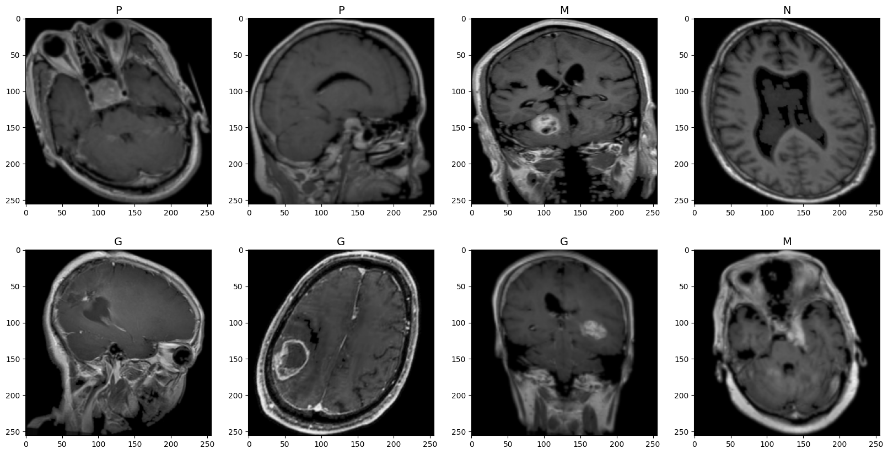
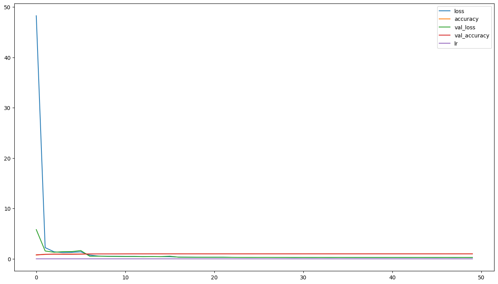

# Brain Tumor Detector
Deep learning enables us to detect tumors from MRI images

## Application

### - docker-compose
Use this command to start a web server with **FastAPI** on port 8000, accessible from 127.0.0.1:8000:
```docker compose up```
### - docker hub
Download the image directly from Docker Hub here: [this link](https://hub.docker.com/r/mahdighaemi/tumor_detector)



## Dataset
The dataset comprises four categories sourced from [this link](https://www.kaggle.com/datasets/susandaneshmand/mri-images/versions/1):
```
- Normal:           438 MRI images
- Glioma tumor:     901 MRI images
- Pituitary tumor:  844 MRI images
- Meningioma tumor: 913 MRI images
```



## Train Model
We have trained a deep neural network based on the pre-trained **EfficientNetB3** using the ImageNet dataset.

```
Model: "sequential"
_________________________________________________________________
Layer (type)                 Output Shape              Param #   
=================================================================
efficientnetb3 (Functional)  (None, 1536)           10783535                                                                
                                                                  
batch_normalization (Batch   (None, 1536)              6144      
Normalization)                                                  
                                                                 
dense (Dense)                (None, 256)               393472    
                                                                 
dropout (Dropout)            (None, 256)               0         
                                                                 
dense_1 (Dense)              (None, 4)                 1028      
                                                                 
=================================================================
Total params: 11,184,179 (42.66 MB)
Trainable params: 11,093,804 (42.32 MB)
Non-trainable params: 90,375 (353.03 KB)
_________________________________________________________________
```

#### Train Accuracy/Loss:
```
- Original training augmentation   -> loss: 0.3890 - accuracy: 0.9983
- No augmentation                  -> loss: 0.3883 - accuracy: 0.9987
- Lower quality image augmentation -> loss: 0.3873 - accuracy: 0.9983
```

#### Test Accuracy/Loss:
```
- No augmentation                  -> loss: 0.4488 - accuracy: 0.9819
- Lower quality image augmentation -> loss: 0.4715 - accuracy: 0.9703
```


## Kagle
You can access notebook on kaggle: [this link](https://www.kaggle.com/code/mahdighaemi/tumor-detection-model)

## Developer
MahdiGhaemi
